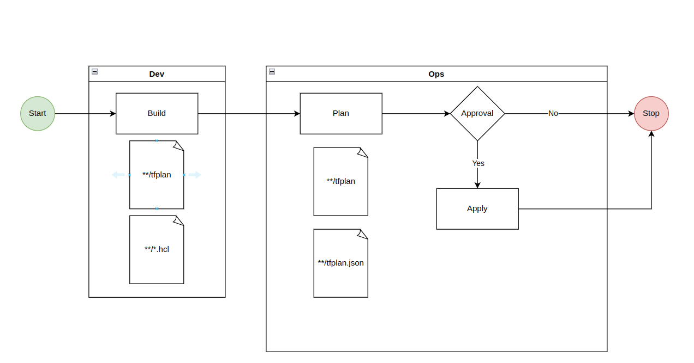

# How to not lose terraform features using terragrunt

The goal is create robust and scalable framework, allowing us apply CI/CD practices to the infrastructure created with terraform in easy and efficient way.

The core goals:

1. Semantic versioning
2. CI/CD Driven
3. CI/CD Platform agnostic
4. Support local development
5. Support multiple environment.
6. Support environments parametrization
7. Account/Region agnostic

## Goals

Arcu odio ut sem nulla pharetra diam sit amet nisl. Proin libero nunc consequat interdum varius sit amet mattis vulputate.

### CI/CD Driven



## Terraform Overview

TODO Lorem ipsum dolor sit amet, consectetur adipiscing elit, sed do eiusmod tempor incididunt ut labore et dolore magna aliqua. Senectus et netus et malesuada fames ac. Scelerisque in dictum non consectetur a. Pretium viverra suspendisse potenti nullam. Eget arcu dictum varius duis at consectetur lorem donec massa. A lacus vestibulum sed arcu non odio. Purus sit amet luctus venenatis lectus magna. Arcu odio ut sem nulla pharetra diam sit amet nisl. Proin libero nunc consequat interdum varius sit amet mattis vulputate. In ornare quam viverra orci. Massa id neque aliquam vestibulum morbi blandit. Malesuada bibendum arcu vitae elementum curabitur vitae. Viverra adipiscing at in tellus integer feugiat scelerisque.

## Terragrunt Overview

TODO Lorem ipsum dolor sit amet, consectetur adipiscing elit, sed do eiusmod tempor incididunt ut labore et dolore magna aliqua. Adipiscing diam donec adipiscing tristique risus nec feugiat. Suscipit adipiscing bibendum est ultricies integer quis. Augue eget arcu dictum varius duis at consectetur lorem donec. Facilisi morbi tempus iaculis urna id volutpat lacus. Nisl condimentum id venenatis a. Congue nisi vitae suscipit tellus. Amet consectetur adipiscing elit ut aliquam purus. Consectetur libero id faucibus nisl tincidunt eget nullam non nisi. Diam in arcu cursus euismod quis viverra. Dui faucibus in ornare quam viverra orci sagittis eu volutpat. Urna porttitor rhoncus dolor purus. Pulvinar etiam non quam lacus suspendisse faucibus interdum posuere. Scelerisque viverra mauris in aliquam sem fringilla ut. Vel quam elementum pulvinar etiam non quam lacus suspendisse. Dolor sed viverra ipsum nunc aliquet bibendum enim. Non diam phasellus vestibulum lorem sed risus ultricies tristique. Consectetur libero id faucibus nisl.

## Standard Terraform/Terragrunt Approach

If you will follow [Terragrunt Quick Start Guide](https://terragrunt.gruntwork.io/docs/getting-started/quick-start/) you probably end with file structure similar to this.

```sh
# infrastructure-live
├── terragrunt.hcl
├── prod
│   ├── app
│   │   └── terragrunt.hcl
│   ├── mysql
│   │   └── terragrunt.hcl
│   └── vpc
│       └── terragrunt.hcl
├── qa
│   ├── app
│   │   └── terragrunt.hcl
│   ├── mysql
│   │   └── terragrunt.hcl
│   └── vpc
│       └── terragrunt.hcl
└── stage
    ├── app
    │   └── terragrunt.hcl
    ├── mysql
    │   └── terragrunt.hcl
    └── vpc
        └── terragrunt.hcl
```

The root terragrunt file will probably contain provider and remote state configuration:

```terraform
remote_state {
  backend = "s3"
  generate = {
    path      = "backend.tf"
    if_exists = "overwrite_terragrunt"
  }
  config = {
    bucket = "my-terraform-state"

    key = "${path_relative_to_include()}/terraform.tfstate"
    region         = "us-east-1"
    encrypt        = true
    dynamodb_table = "my-lock-table"
  }
}

generate "provider" {
  path = "provider.tf"
  if_exists = "overwrite_terragrunt"
  contents = <<EOF
provider "aws" {
  assume_role {
    role_arn = "arn:aws:iam::0123456789:role/terragrunt"
  }
}
EOF
}
```

Each of the leaf terragrunt file will be contain module declaration.

```terraform
# infrastructure-live/stage/app/terragrunt.hcl
terraform {
  source = "github.com:foo/infrastructure-modules.git//app?ref=v0.0.1"
}
inputs = {
  instance_count = 3
  instance_type  = "t2.micro"
}
```

When I start my journey with terragrunt this approach work fine when the number of the environment was well known and infrastructure has been build from 5-10 modules. It solve multiple terraform problems especially reduce redundancy in the provider and remote state configuration and provide very confined way to execute terraform commands for multiple modules.

But when environment infrastructure start getting be more complex and number of the environments increase some problem start appear. To begin with promotions by copping files, the configurations of environments are usually slightly different and after each promotion is necessary to manually correct some values, in addition you need repeat this process for each module, this produce high change of making mistake.
Futhermore you can't answer in simple way the question: "What version of the infrastructure is currently on the `stage` environment?" or "Are versions on the `stage` and `prod` the same?" To answer this question you need check version of every module. ... The next issue is lack of the support for the some features introduced in the newer version of the terraform like `moved`, `import` or even lack of the support for standard Terraform features like `data` block can be pain in the neck.

## Present modified version

To address mentioned issues we need slightly modify previous structure. First reduce the number of the infrastructure definition to single instance which solve both the promotion and the versioning issue.

```sh
├── terragrunt.hcl
└── infrastructure
    ├── app
    │   └── terragrunt.hcl
    ├── mysql
    │   └── terragrunt.hcl
    └── vpc
        └── terragrunt.hcl
```

 Let's explain versioning first. We have now single instance of each module and all environments use the same base so we can simply add version tag eg.: `0.0.1` and this will contain versions of all modules. We can now create infrastructure artifact and use this as blue print for as many environments as we want which solve the Promotion issue. For example we can easy create temporal environment and test infrastructure upgrade process.

Unfortunately this approach generate problem with standard remote state generation because we have conflicted keys for the terraform remote states. The fix for this issue is relatively simple to solve by introduce few environment variables.

```hcl
locals {
  env_name                          = lower(get_env("INF_ENV_NAME"))
  aws_region                        = lower(get_env("INF_ENV_REGION"))
  tfstate_s3_bucket_name            = lower(get_env("INF_TFSTATE_S3_BUCKET_NAME"))
  tfstate_s3_bucket_region          = lower(get_env("INF_TFSTATE_S3_BUCKET_REGION"))
}

remote_state {
  backend = "s3"

  generate = {
    path      = "backend.tf"
    if_exists = "overwrite_terragrunt"
  }

  config = {
    bucket         = local.tfstate_s3_bucket_name
    dynamodb_table = local.tfstate_s3_bucket_name # Note: For simplicity the name of the DynamoDb table is the same as s3 bucket name
    encrypt      = true
    key          = lower("${local.env_name}/${path_relative_to_include()}/terraform.tfstate")
    session_name = "terraform"
    region       = local.tfstate_s3_bucket_region
  }
}

generate "provider" {
  path      = "provider.tf"
  if_exists = "overwrite_terragrunt"

  contents = <<EOF
    provider "aws" {
        region  = "${local.aws_region}"
    }
  EOF
}
```

After solve the backend configuration issue we need also provide method to pass values differentiate environments.
For this purpose we can use environment variables and configuration files.

```hcl
include "root" {
  path   = find_in_parent_folders()
  expose = true
}

include "terraform" {
  path = find_in_parent_folders("_common/terraform.hcl")
}

locals {
  json_config =jsondecode(file(find_in_parent_folders("${include.root.locals.env_name}.json")))
}

terraform {
  source = "github.com:foo/infrastructure-modules.git//app?ref=v0.0.1"
}

inputs = {
  instance_count = local.json_config.app.instance_count
  instance_type  = local.json_config.app.instance_type
  tags = {
    Environment=include.root.locals.env_name
  }
}
```

Now we can simply define as many environment as we want without change the code base.

**Note:** Before interact with infrastructure in different environment we need remove `.terragrunt_cache` by execute `<rm with find command here>`. 

```sh
├── terragrunt.hcl
└── infrastructure
    ├── app
    │   ├── main.tf
    │   └── terragrunt.hcl
    ├── mysql
    │   ├── main.tf
    │   └── terragrunt.hcl
    └── vpc
        ├── main.tf
        └── terragrunt.hcl
```

The difference between environments need to be pass via environment variables or by configuration files. For more complex scenario I recommend use configuration files but in this example we use environment variables for bre

WHY???

- Access all latest terraform functionalities
  - Import block
- Allow terragrunt manage more than one module
  - Data resources
  - Multiple module blocks
  - Single resources

Provide example of the move block, import block

Discuses pros and cont of this approach.

Please review it Michał

BLOG: Requirments:

- Blog Content
  - H1-H6 support
  - Bold
  - Italic
  - Ordered list
  - Unordered list
  - External links
  - Internal links
  - TOC
  - Images
  - Code fragments with possibility to copy they using one click
  - Separation lines
- Functional
  - Possiblity to create series
  - Buttons redirecting directly to the next and previous blog
